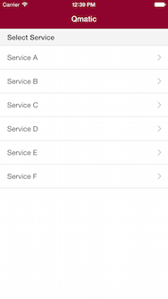
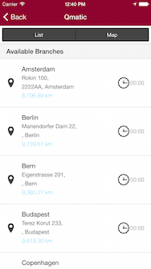
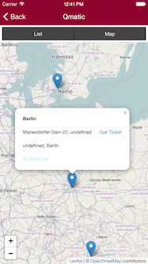
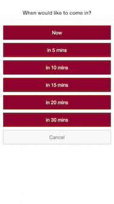

#mobile-example
Hybrid mobile app example demonstrating [Qmatic](http://www.qmatic.com) mobile API using [Ionic Framework](http://ionicframework.com/)

##Overview
A simple example that provides functionality to select a service, branch, issue and delete tickets.
Built with [Ionic Framework](http://ionicframework.com/), shows how easy it is to develop hybrid apps against the [Qmatic](http://www.qmatic.com) mobile extension API.

##Using
* Install [Node.js](https://nodejs.org/)
* Install [Gulp](https://github.com/gulpjs/gulp/blob/master/docs/getting-started.md)
* Install [Ionic Framework](http://ionicframework.com/docs/guide/installation.html)
* Install JDK (android only)
* Install [Android SDK](http://developer.android.com) (android only)
* Clone this repo `git clone git@github.com:qmatic/mobile-example.git`
* From the repo root run the following commands:

		$ npm install
		$ gulp install
		$ cordova platform add ios
		$ cordova platform add android
		$ cordova plugin add cordova-plugin-device
		$ cordova plugin add cordova-plugin-statusbar
		$ cordova plugin add cordova-plugin-geolocation
		$ cordova plugin add cordova-plugin-whitelist

//for push notifications
        $ ionic add ionic-service-core
        $ ionic add ionic-service-push
        $ ionic add ionic-platform-web-client

		$ ionic plugin add cordova-plugin-console
        $ ionic plugin add cordova-plugin-device
        $ ionic plugin add cordova-plugin-dialogs
        $ ionic plugin add cordova-plugin-file
        $ ionic plugin add cordova-plugin-media
        $ ionic plugin add https://github.com/phonegap-build/PushPlugin
//for push notifications

		$ cordova plugin add https://github.com/EddyVerbruggen/Toast-PhoneGap-Plugin.git

		$ ionic resources
		$ gulp sass
		$ ionic build (ios / android)
		$ ionic emulate (ios / android)

For more information see the [Ionic documentation](http://ionicframework.com/docs/)

Configure URL, username, and password of Orchestra Mobile API endpoint in www/js/app.js:

        .constant('MobileEndpoint', {
          //url: 'http://localhost:8080',
          url: '',
          username: 'xxxx',
          password: 'xxxx'
        })

When testing in browser via `ionic serve` leave URL empty and configure proxyURL in ionic.project:

    "proxies": [
        {
            "path": "/qsystem/mobile/rest",
            "proxyUrl": "http://localhost:8080/qsystem/mobile/rest"
        }
    ]

##Screenshots

